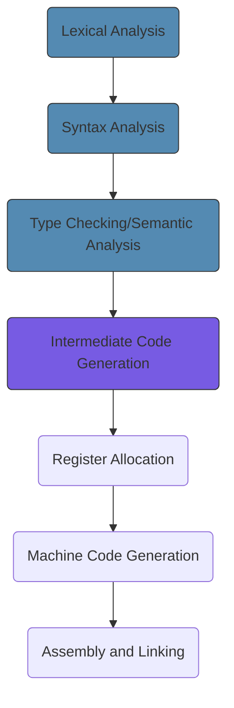
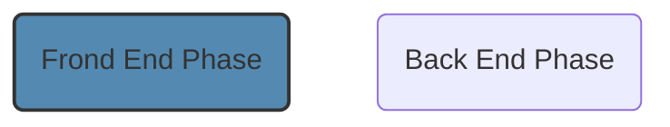

# Compiler

## Overview

==A compiler is a program that translates a *source language* text into a equivalent *target language* text.== ^aa6b15

![[compiler overview.png]]

==or==

The simplest defintion of a compiler is a program that translates code written in a high-level programming language (like Java) into a low-level code( like Bytecode in Java or Assembly) directly executable by the computer or another program such as a virtual machine such as Java Virtual Machine(JVM).

---

## Why Compiler is Needed?
Computer are made to execute relative simple command. A program for a computer must be built by combining these very simple commands into a program in what is called *machine language* Since this is a tedious and error-prone process most programming is, instead, done using a high-level programming language. This language is very different from the machine language that the computer can execute, so some menas of bridging the gap is required. This is where the *compiler* comes in.

**Compiler**
- Translates a programming written in a high-level programming language that is suitable for human programmers into the low-level programming laguage that is required by computers.
- During the process ,the compiler will also attempt to spot and report obvious programmer mistakes.

**Benefits of high-level programming language:**
- The notation used by it is closer to the way human think about problems, compared to machine language.
- The compiler can spot some obvious programming mistakes ( such as typos )
- Same program that is written in high-level programming language can be compile to many different machine language, and hence, be brought to run on many different machines. For example. program written in [[Java]] can be compiled into Bytecode that is understandable by Java Virtual Machine, thus as long as a machine supports the JVM, the program can run on that machine. Thus the slogan for Java, "Compiled Once Run Anywhere")  

   

### Properties of Low-level and High-Level programming language
---
Low-level programming language (Assembly or Bytecode) - a formal language with mathematical properties and well-defined language - rather than a natural langauge with evolved properties and many ambiguities.

## Principles 
Compilers are engineered objects - software system built with distinct goals in mind. In building a compiler, the compiler writed make myriad design decisions. While many issues in compiler design are amendable to several different solutions, there are `two` principle that should not be compromised.

- The compiler `must` preserve the meaning off the program being compiled
> The code produced by the compiler must faithfully implement the "meaning" of the source code program being compiled. If the compiler can take liberties with meaning, then it can always generate the same code, independent of input.
 
 - The compiler must improve the source code in some discernible way
 > A traditiomal compiler improve the code by making it directly executble on some target machine.
## 2 parts of a Compiler
The first one generally called the **front-end** scans the submitted source code for syntax errors, checks( and infers if necessary ) the type of each declared variables and ensures that each variable is declared before use. It maintains a data structure called **symbol table** which contain information about all the symbols found in the source code. If not error is detected, another data structure, called **intermediate representation** of the code, is built from the source code and pass as input to the second part.

The **back-end** uses the ==intermediate representation==  and the symbol table built by the front-end to generate low-level code.

## Phases of a Compiler
| Steps   |     Description     |  
|----------|:-------------:|
| 1 | [[#Lexical Analysis]] |
| 2|   [[#Syntax Analysis]]   |
| 3 | [[#Type Checking/Semantic Analysis]] | 
| 4 | [[#Intermediate Code Generation]] |
| 5 | [[#Register Allocation]] |
| 6 | [[#Machine Code Generation]] |
| 7 | [[#Assembly and Linking]] |

==*Description of the Colour*==

>Intermediate Code Generation considered as part of the front-end phase of the compiler in some books. Some refer it as a middle, excluded from front and back.

### Lexical Analysis
[[Lexical Analysis]] This is the initial part of reading and analysing the program text. The text is read then groups of raw characters are grouped into divided into meaningful ==tokens== , each of which coresponds to a symbol in the programminng language, e.g., a variable name, keyword or number.

Conceptually, the lexical analyzer transform a sequence of fcharacters into a sequence of token. In addition, a lexical analyzed will typically access the ==symbol table==  to store and/or retrieve information on certain source language concepts such as variables, functions, types. 

![[output of lexical analysis_token.png]]

### Syntax Analysis

^syntax

[[Syntax Analysis]] This phase take the list of tokens produced by the lexical analysis and arranges these in a tree-structure ( called the ==syntax tree==/Abstract Syntax Tree, AST ) that reflects the structure of the program. This phase is often called ==parsing==.

![[tree_structure of syntax analysis.png]]

Syntax analysis is also he phase where eventual syntax errors are detected and reported to the user.

### Type Checking/Semantic Analysis
[[Type Checking_Semantic Analysis]] During semantic analysis, the compiler uses the AST ( [[#^syntax]] ) 
generated during syntax analysis to check if the program is consistent with all the rules of the source programming language. Semantic analysis encompasses:
- Type Inference
	- If the language supports type inference, the compiler will try to infer the type of all untyped expressions in the program. If a type is successfully inferred, the compiler with ==annotate== the corresponding node in the AST with the inferred type information
- Type Checking
- Symbol Management
	- The compiler maintains a data structure called ==symbol table== which contains information about all the symbols encountered in the program. 

> The output of this phase is an **annotated AST** and the **symbol table**

### Intermediate Code Generation
[[Intermediate Code Generation]] The program or we can say, the compiler users the annotated AST to generate a simple-machine independent intermediate language.

One such intermediate representation is the **three-address code**.

The three-address code (3AC), in its simplest form, is a language which an instruction is an assignment and has at most three operands.

Most instructions in 3AC are of the form 
>a := b \<operator> c `OR`
>a := b

The intermediate code generation concludes the ==front phase== of the compiler.

### Register Allocation
[[Register Allocation]] The symbolic variable names used in the intermediate code are translated to numbers, each of which corresponds to a register in the target machine code.

### Machine Code Generation
[[Machine Code Generation]] The intermediate language is translated to ==assembly language== ( a textual representation of machine code ) for a specifc machine architecture (x86, etc. )

### Assembly and Linking
[[Assembly and Linking]] The assembly-language code is translated into binary representation and addresses of variables, functions,etc, are determined.

 

# Read More
[[Creating An Executable Target Program]]